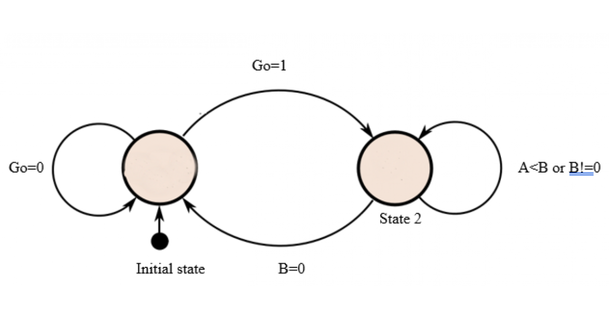

# GCD solution using VHDL

Q. Write the VHDL code for processor (GCD) that calculates greatest common divisor of two integer data with its state diagram. 

# GCD State Diagram

# Result in GTKWAVE

